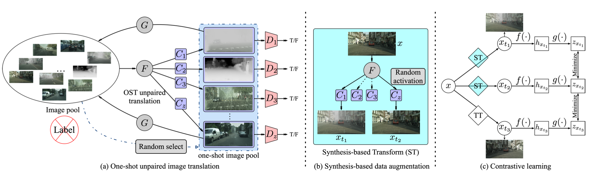
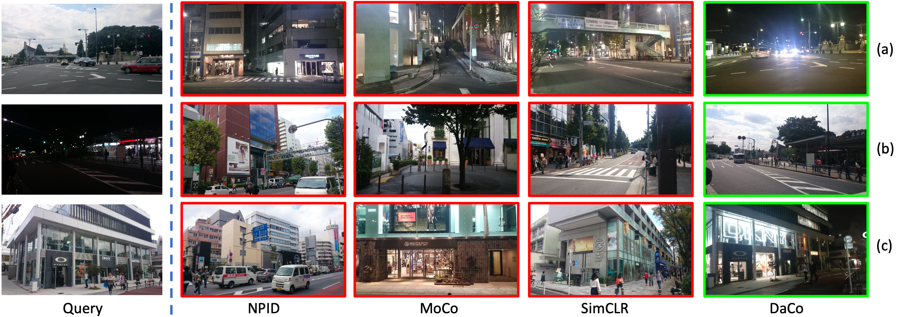
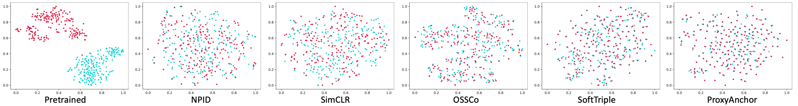

# OSSCo

A PyTorch implementation of OSSCo based on ICCV 2021 paper
[Fully Unsupervised Image Retrieval With One-Shot Synthesis-based Contrastive Learning]().



## Requirements

- [Anaconda](https://www.anaconda.com/download/)
- [PyTorch](https://pytorch.org)

```
conda install pytorch=1.7.1 torchvision cudatoolkit=11.0 -c pytorch
```

- [Pytorch Metric Learning](https://kevinmusgrave.github.io/pytorch-metric-learning/)

```
pip install pytorch-metric-learning
```

- [THOP](https://github.com/Lyken17/pytorch-OpCounter)

```
pip install thop
```

## Dataset

[Cityscapes FoggyDBF](https://www.cityscapes-dataset.com/) and
[CUFSF](http://mmlab.ie.cuhk.edu.hk/archive/cufsf/) datasets are used in this repo, you could download these datasets
from official websites, or download them from [MEGA](https://mega.nz/folder/5sQD0QqK#zM5GfOSPvpPpfquGJd8Vjg). The data
should be rearranged, please refer the paper to acquire the details of `train/val` split. The data directory structure
is shown as follows:

 ```
 cityscapes
    ├── train
       ├── clear (clear images)
           ├── aachen_000000_000019_leftImg8bit.png
           └── ...
           ├── bochum_000000_000313_leftImg8bit.png
           └── ...
       ├── fog (fog images)
           same structure as clear
           ...         
    ├── val
       same structure as train
   ...
cufsf
    same structure as cityscapes
```

## Usage

```
python main.py or comp.py --data_name cufsf
optional arguments:
# common args
--data_root                   Datasets root path [default value is 'data']
--data_name                   Dataset name [default value is 'cityscapes'](choices='cityscapes', 'cufsf'])
--method_name                 Compared method name [default value is 'ossco'](choices=['ossco', 'simclr', 'npid', 'proxyanchor', 'softtriple', 'pretrained'])
--proj_dim                    Projected feature dim for computing loss [default value is 128]
--temperature                 Temperature used in softmax [default value is 0.1]
--batch_size                  Number of images in each mini-batch [default value is 16]
--total_iter                  Number of bp to train [default value is 10000]
--ranks                       Selected recall to val [default value is [1, 2, 4, 8]]
--save_root                   Result saved root path [default value is 'result']
# args for ossco
--style_num                   Number of used styles [default value is 8]
--gan_iter                    Number of bp to train gan model [default value is 4000]
--rounds                      Number of round to train whole model [default value is 3]
```

For example, to train `npid` on `cufsf` dataset, report `R@1` and `R@5`:

```
python comp.py --method_name npid --data_name cufsf --batch_size 64 --ranks 1 5
```

to train `ossco` on `cityscapes` dataset, with `16` random selected styles:

```
python main.py --method_name ossco --data_name cityscapes --style_num 16
```

## Benchmarks

The models are trained on one NVIDIA GTX TITAN (12G) GPU. `Adam` is used to optimize the model, `lr` is `1e-3`
and `weight decay` is `1e-6`. `batch size` is `16` for `ossco`, `32` for `simclr`, `64` for `npid`.
`lr` is `2e-4` and `betas` is `(0.5, 0.999)` for GAN, other hyper-parameters are the default values.

### Cityscapes

<table>
<thead>
  <tr>
    <th rowspan="2">Method</th>
    <th colspan="4">Clear --&gt; Foggy</th>
    <th colspan="4">Foggy --&gt; Clear</th>
    <th colspan="4">Clear &lt;--&gt; Foggy</th>
    <th rowspan="2">Download</th>
  </tr>
  <tr>
    <td align="center">R@1</td>
    <td align="center">R@2</td>
    <td align="center">R@4</td>
    <td align="center">R@8</td>
    <td align="center">R@1</td>
    <td align="center">R@2</td>
    <td align="center">R@4</td>
    <td align="center">R@8</td>
    <td align="center">R@1</td>
    <td align="center">R@2</td>
    <td align="center">R@4</td>
    <td align="center">R@8</td>
  </tr>
</thead>
<tbody>
  <tr>
    <td align="center">Pretrained</td>
    <td align="center">22.80</td>
    <td align="center">29.40</td>
    <td align="center">37.20</td>
    <td align="center">46.40</td>
    <td align="center">21.60</td>
    <td align="center">28.40</td>
    <td align="center">35.60</td>
    <td align="center">43.60</td>
    <td align="center">5.90</td>
    <td align="center">8.30</td>
    <td align="center">11.20</td>
    <td align="center">14.10</td>
    <td align="center"><a href="https://pan.baidu.com/s/1Y9shBKadeBhkifopHexioA">r2bg</a></td>
  </tr>
  <tr>
    <td align="center">NPID</td>
    <td align="center">22.80</td>
    <td align="center">29.40</td>
    <td align="center">37.20</td>
    <td align="center">46.40</td>
    <td align="center">21.60</td>
    <td align="center">28.40</td>
    <td align="center">35.60</td>
    <td align="center">43.60</td>
    <td align="center">5.90</td>
    <td align="center">8.30</td>
    <td align="center">11.20</td>
    <td align="center">14.10</td>
    <td align="center"><a href="https://pan.baidu.com/s/1Y9shBKadeBhkifopHexioA">r2bg</a></td>
  </tr>
  <tr>
    <td align="center">SimCLR</td>
    <td align="center">92.20</td>
    <td align="center">94.60</td>
    <td align="center">96.60</td>
    <td align="center">97.80</td>
    <td align="center">89.60</td>
    <td align="center">93.00</td>
    <td align="center">95.40</td>
    <td align="center">98.20</td>
    <td align="center">80.10</td>
    <td align="center">85.40</td>
    <td align="center">88.80</td>
    <td align="center">92.30</td>
    <td align="center"><a href="https://pan.baidu.com/s/1yZhkba1EU79LwqgizDzTUA">agdw</a></td>
  </tr>
  <tr>
    <td align="center">SoftTriple</td>
    <td align="center">99.60</td>
    <td align="center">99.80</td>
    <td align="center">100.00</td>
    <td align="center">100.00</td>
    <td align="center">99.80</td>
    <td align="center">99.80</td>
    <td align="center">99.80</td>
    <td align="center">100.00</td>
    <td align="center">98.40</td>
    <td align="center">99.70</td>
    <td align="center">99.80</td>
    <td align="center">99.90</td>
    <td align="center"><a href="https://pan.baidu.com/s/1yZhkba1EU79LwqgizDzTUA">agdw</a></td>
  </tr>
  <tr>
    <td align="center">ProxyAnchor</td>
    <td align="center">100.00</td>
    <td align="center">100.00</td>
    <td align="center">100.00</td>
    <td align="center">100.00</td>
    <td align="center">100.00</td>
    <td align="center">100.00</td>
    <td align="center">100.00</td>
    <td align="center">100.00</td>
    <td align="center">100.00</td>
    <td align="center">100.00</td>
    <td align="center">100.00</td>
    <td align="center">100.00</td>
    <td align="center"><a href="https://pan.baidu.com/s/1yZhkba1EU79LwqgizDzTUA">agdw</a></td>
  </tr>
  <tr>
    <td align="center">OSSCo</td>
    <td align="center"><b></b></td>
    <td align="center"><b></b></td>
    <td align="center"><b></b></td>
    <td align="center"><b></b></td>
    <td align="center"><b></b></td>
    <td align="center"><b></b></td>
    <td align="center"><b></b></td>
    <td align="center"><b></b></td>
    <td align="center"><b></b></td>
    <td align="center"><b></b></td>
    <td align="center"><b></b></td>
    <td align="center"><b></b></td>
    <td align="center"><a href="https://pan.baidu.com/s/139IHtS2_tOZcEK2Qgt-yQw">5dzs</a></td>
  </tr>
</tbody>
</table>

### CUFSF

<table>
<thead>
  <tr>
    <th rowspan="2">Method</th>
    <th colspan="4">Sketch --&gt; Image</th>
    <th colspan="4">Image --&gt; Sketch</th>
    <th colspan="4">Sketch &lt;--&gt; Image</th>
    <th rowspan="2">Download</th>
  </tr>
  <tr>
    <td align="center">R@1</td>
    <td align="center">R@2</td>
    <td align="center">R@4</td>
    <td align="center">R@8</td>
    <td align="center">R@1</td>
    <td align="center">R@2</td>
    <td align="center">R@4</td>
    <td align="center">R@8</td>
    <td align="center">R@1</td>
    <td align="center">R@2</td>
    <td align="center">R@4</td>
    <td align="center">R@8</td>
  </tr>
</thead>
<tbody>
  <tr>
    <td align="center">Pretrained</td>
    <td align="center">22.80</td>
    <td align="center">29.40</td>
    <td align="center">37.20</td>
    <td align="center">46.40</td>
    <td align="center">21.60</td>
    <td align="center">28.40</td>
    <td align="center">35.60</td>
    <td align="center">43.60</td>
    <td align="center">5.90</td>
    <td align="center">8.30</td>
    <td align="center">11.20</td>
    <td align="center">14.10</td>
    <td align="center"><a href="https://pan.baidu.com/s/1Y9shBKadeBhkifopHexioA">r2bg</a></td>
  </tr>
  <tr>
    <td align="center">NPID</td>
    <td align="center">37.19</td>
    <td align="center">48.74</td>
    <td align="center">63.82</td>
    <td align="center">73.37</td>
    <td align="center">40.70</td>
    <td align="center">52.76</td>
    <td align="center">67.84</td>
    <td align="center">73.87</td>
    <td align="center">27.14</td>
    <td align="center">34.42</td>
    <td align="center">45.98</td>
    <td align="center">60.05</td>
    <td align="center"><a href="https://pan.baidu.com/s/1oUbOqWIJaJbtUDqcqmklgw">bbiv</a></td>
  </tr>
  <tr>
    <td align="center">SimCLR</td>
    <td align="center">24.12</td>
    <td align="center">39.20</td>
    <td align="center">56.28</td>
    <td align="center">72.36</td>
    <td align="center">32.66</td>
    <td align="center">45.23</td>
    <td align="center">56.28</td>
    <td align="center">68.84</td>
    <td align="center">15.08</td>
    <td align="center">21.86</td>
    <td align="center">33.67</td>
    <td align="center">48.99</td>
    <td align="center"><a href="https://pan.baidu.com/s/1ogY5eC1eb3IHemOsVO-ieg">hdhn</a></td>
  </tr>
  <tr>
    <td align="center">SoftTriple</td>
    <td align="center">86.43</td>
    <td align="center">92.46</td>
    <td align="center">95.48</td>
    <td align="center">98.99</td>
    <td align="center">89.45</td>
    <td align="center">93.47</td>
    <td align="center">97.49</td>
    <td align="center">99.50</td>
    <td align="center">79.65</td>
    <td align="center">85.93</td>
    <td align="center">92.71</td>
    <td align="center">96.23</td>
    <td align="center"><a href="https://pan.baidu.com/s/1yZhkba1EU79LwqgizDzTUA">agdw</a></td>
  </tr>
  <tr>
    <td align="center">ProxyAnchor</td>
    <td align="center">95.48</td>
    <td align="center">97.99</td>
    <td align="center">100.00</td>
    <td align="center">100.00</td>
    <td align="center">95.48</td>
    <td align="center">98.49</td>
    <td align="center">100.00</td>
    <td align="center">100.00</td>
    <td align="center">91.71</td>
    <td align="center">95.73</td>
    <td align="center">98.24</td>
    <td align="center">99.75</td>
    <td align="center"><a href="https://pan.baidu.com/s/1yZhkba1EU79LwqgizDzTUA">agdw</a></td>
  </tr>
  <tr>
    <td align="center">OSSCo</td>
    <td align="center"><b></b></td>
    <td align="center"><b></b></td>
    <td align="center"><b></b></td>
    <td align="center"><b></b></td>
    <td align="center"><b></b></td>
    <td align="center"><b></b></td>
    <td align="center"><b></b></td>
    <td align="center"><b></b></td>
    <td align="center"><b></b></td>
    <td align="center"><b></b></td>
    <td align="center"><b></b></td>
    <td align="center"><b></b></td>
    <td align="center"><a href="https://pan.baidu.com/s/1ForxWPJ_k3Eq_EXgLtpHCA">azvx</a></td>
  </tr>
</tbody>
</table>

## Results

### Cityscapes



### CUFSF


### T-SNE


